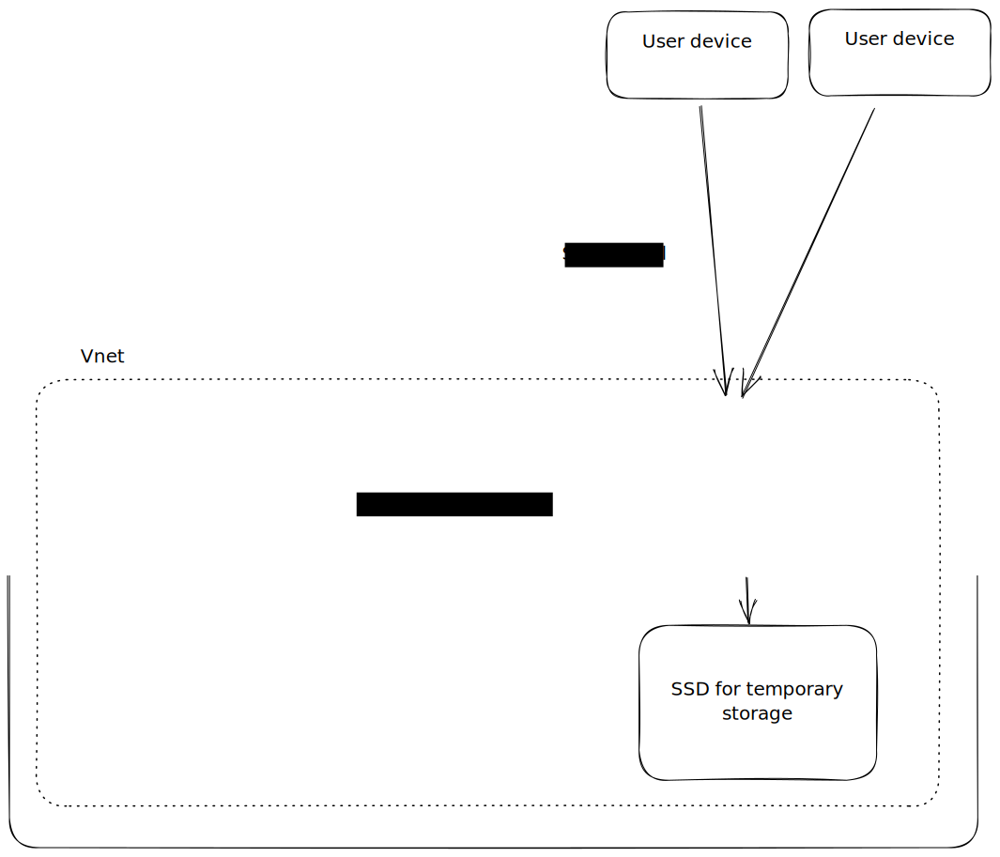

# Analysis environment for the D3I-pilot

This folder contains Terraform code to deploy an analysis environment for collaboration purposes.
The analysis environment consists of a JupyterHub server connected to storage accounts.

For more in instructions and more information see: [User information](#User-information) or [Admin information](#Admin-information)

# User information

## Access the analysis environment

Create a secure tunnel to the analysis server using ssh. All traffic to and from the server will be going through this tunnel.

Create the tunnel with the following command:

```
ssh -L 8080:localhost:80 <your-username>@<public-ip or domain name of the server>
```

The username, password and ip address or domain name of the server will be provided by your administrator. After creating the tunnel you can go to your browser and put the following in the address bar:

```
localhost:8080
```

You should be presented with a JupyterHub login screen.

Tip, copy your public ssh key for passwordless access.

```
ssh-copy-id -i ~/.ssh/my_public_key <your-username>@<public-ip or domain name of the server>
```

## Log in to JupyterLab

The first time logging in you can create your account by entering your name and password. 
Do not forget this, you need these for subsequent logins.

## Installing Python packages

You can install your own packages with `pip`.

## Access to the storage account

In order to get access you need to be logged in. 
In order to login use the following command in a terminal on the server, and follow instructions.

```
az login
```

Use the storage accounts for data you want to store. No data should be stored in your local folder, code should be stored in a git repository.

## How to access data using Python Azure SDK

In order to obtain data from a storage account the Python Azure SDK needs to be used. 

Here you can find code examples of common action (if you miss packages you can install them yourself, see for example: `pip3 install azure.identity`):

<details>
<summary>Import packages and set the needed variables</summary>

```python

from azure.identity import DefaultAzureCredential
from azure.storage.blob import ContainerClient, BlobServiceClient

STORAGE_ACCOUNT = "d3ipilotanalysisserversa"
CONTAINER = "my-test-container"
ACCOUNT_URL = f"https://{STORAGE_ACCOUNT}.blob.core.windows.net"
CREDENTIAL = DefaultAzureCredential()  # make sure you are logged in (az login)
```

</details>

<details>
<summary>Download a specific blob</summary>

```python
filename = "my_file.json"
blob_service_client = BlobServiceClient(ACCOUNT_URL, CREDENTIAL)
blob_client = blob_service_client.get_blob_client(CONTAINER, blob=filename)
blob_data = blob_client.download_blob().readall()
```

</details>

<details>
<summary>List all blobs in a container</summary>

```python
container_client = ContainerClient(ACCOUNT_URL, CONTAINER, credential=CREDENTIAL)
blob_list = container_client.list_blobs()
for blob in blob_list:
    print(blob.name)
```

</details>

<details>
<summary>Convert a pd.DataFrame to xlsx and upload to container</summary>

```python
import io
import pandas as pd

data = [(1, "a"), (2, "b"), (3, "c")]
df = pd.DataFrame(data, columns=["id", "favorite_letter"])

buffer = io.BytesIO()
with pd.ExcelWriter(buffer) as writer:
    df.to_excel(writer)  
    
blob_service_client = BlobServiceClient(ACCOUNT_URL, CREDENTIAL)
blob_client = blob_service_client.get_blob_client(CONTAINER, blob="my_dataset.xlsx")
blob_client.upload_blob(buffer.getvalue(), overwrite=True)
```

</details>

# Admin information

## Architecture

The architecture of the analysis environment is as follows:



## Deployment

This environment can be deployed using `terraform`. Cloud-init is used to configure the virtual machine on first boot.

## User setup

Users connect through the server using ssh. So they will need non-super users accounts.
Authentication of the users to the storage accounts will be through `az login` and access is granted according to their assigned roles which can be configured in the azure portal.
An advantage of this approach is you do not have to buy a domain name in order to install certificates for TLS also less configuration need.
A downside is that you have to manage accounts and credentials for your users, in case you have very few users this option is viable. See `./user-management` for a solution with Ansible.

An alternative would be to obtain (buy) a domain name and configure access through an OAuthprovider.
A downside is you have to own a domain, you have to do more configuration, but less user management.

## Configure JupyterHub

Inspect the configuration of JupyterHub in the `cloudinit/userdata.yaml` and change it to your needs.

## Bulk copy of data between storage accounts

For a one off bulk copy of data in storage accounts on Azure you can use azcopy:

```
azcopy copy 'https://mysourceaccount.blob.core.windows.net/<SAS-token>' 'https://mydestinationaccount.blob.core.windows.net/<SAS-token>' --recursive
```

Generate SAS tokens with the correct permissions.

